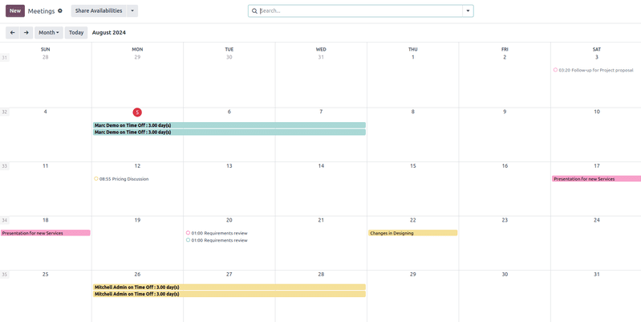
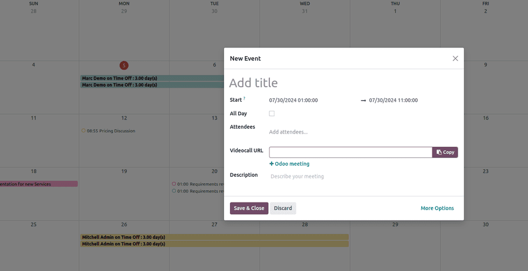
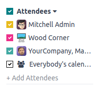
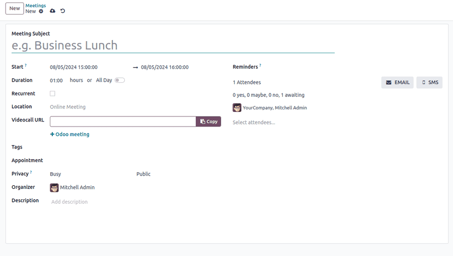
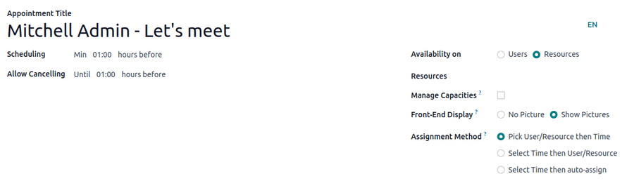

:show-content:
:show-toc:

========
Calendar
========

.. toctree::
   :titlesonly:

   calendar/outlook
   calendar/google

Odoo Calendar is a scheduling app that allows users to integrate a company’s business flow into a
single management platform. By integrating with the other apps in Odoo’s ecosystem, Calendar allows
users to schedule meetings, organize meetings, schedule events, plan employee appraisals,
coordinate projects, and more – all from the same platform.

In the **Calendar** app, users have an overview of their current meetings. The selected view option
will appear as a :guilabel:`Day`, :guilabel:`Week`, :guilabel:`Month`, or :guilabel:`Year` button.
Under the view options, users can also enable or disable :guilabel:`Show weekends`.

Depending on the selected view option, users can use the arrow buttons to switch between days, weeks
, etc., then switch back to the current day with the :guilabel:`Today` button.

Sync third-party calendars
--------------------------

Users can sync Odoo with existing :doc:`Outlook <calendar/outlook>` and/or :doc:`Google
<calendar/google>` calendars by heading to :menuselection:`Calendar --> Configuration --> Settings`.
Events created in synced calendars will automatically appear across the integrated platforms.

Create Calendar activities from chatter
---------------------------------------

Instantly create new meetings anywhere in Odoo through an individual record’s chatter, like
in a CRM opportunity card or Project Task.

From chatter, click on the :guilabel:`Activities` button. In the new :guilabel:`Schedule Acitivity`
window, select :guilabel:`Activity Type`, which will populate a set of smart buttons depending on
the activity. Activities that would involve other attendees' schedules like :guilabel:`Meeting` or
:guilabel:`Call for Demo` will link to **Calendar** app.

.. image:: calendar/calendar-chatter-activity-type-call-for-demo.png
   :align: center
   :alt: Schedule an Activity window on CRM app: Schedule a call for demo.

Plan an event
-------------

To put an event on the calendar, click into the target date. Under **New Event** in the new window,
add the event title.

The target date auto-populates in the :guilabel:`Start` section. This can be changed by clicking
into the date section and selecting a date from the calendar. For multi-day evebts, select the end
date on the right calendar, then click the :guilabel:`Apply` button.

Additional event information can also be configured:

The :guilabel:`All Day` checkbox is ticked by default. For events with specific start and stop times
, untick the box to enable time selection, which will automatically populate in the
:guilabel:`Start` section.

The signed-in user will auto-populate as the first attendee. Additional attendees can be added from
existing contacts or created from the event page.

For virtual meetings, copy and paste the URL into the space provided or select :guilabel:`+Odoo
meeting` to create a link. Once the event is created, users can click into the virtual meeting
directly from the calendar event.

Click :guilabel:`More Options` to navigate to the meeting page, which has additional configurations
for the event:

- :guilabel:`Tags`: Add tags like *Customer Meeting* or *Internal Meeting*. These can be searched
  and filtered in the Calendar app when organizing multiple events.
- :guilabel:`Appointment`: Link existing or new appointments that can be configured in
  :guilabel:`Share Availabilities`.
- :guilabel:`Privacy`: Toggle between visibility options to control who can view
  the event.
- :guilabel:`Organizer`: This is defaulted to the current Odoo user. Select a new Organizer from
  existing contacts or create and edit a new contact.
- :guilabel:`Reminders`: Select notification options to sent to attendees. Choose a default
  notification or configure new reminders.

Coordinate with teams
---------------------

When scheduling an event for multiple users, tick the checkbox next to :guilabel:`Attendees` to
view team members' availability. Tick the checkbox next to users to show or hide individual
calendars.

Schedule
~~~~~~~~

In the :guilabel:`Schedule` tab of the new meeting page, add or delete time slots.

Options
~~~~~~~

The :guilabel:`Options` tab provides additional configurations:

- :guilabel:`Front-End Display`: Select **Show Pictures** to share users' or resources' photos on
  the linked meeting page.

- :guilabel:`Timezone`: This is defaulted to the company's time zone selected in **Configuration**.
  To change the time zone, click into the section and select from the drop-down menu.

- :guilabel:`Location`: Select or create new locations on the drop-down menu.

- :guilabel:`Videoconference Link`: Select from Odoo Discuss or Google Meet to include a video
  conference link in the meeting invitation.

- :guilabel:`Up-front Payment`: Tick the checkbox to require users to pay before confirming their
  booking. Once this is checked, a link will appear to :guilabel:`Configure Payment Providers`,
  which will enable online payments.

- :guilabel:`Limit to Work Hours`: Tick the checkbox to limit meeting time slots to
  :doc:`users' working hours <../hr/employees/new_employee>`.

- :guilabel:`Create Opportunities`: When this is selected, each scheduled appointment will create
  a new CRM opportunity.

- :guilabel:`Reminders`: Add or delete notification reminders. Select the blank space for additional
  options.

- :guilabel:`Confirmation Email`: Tick the checkbox to automatically send a confirmation email to
  attendees once the meeting is confirmed. Select from the email templates or click
  :guilabel:`Search More` to create a custom template.

- :guilabel:`Cancellation Email`: Tick the checkbox to automatically send a cancellation email to
  attendees if the meeting is canceled. Select from the email templates or click
  :guilabel:`Search More` to create a custom template.

- :guilabel:`CC to`: Add contacts to be notified of meeting updates, regardless if they attend
  the meeting.

- :guilabel:`Allow Guests`: Tick the checkbox to allow invitees to invite guests.

Questions
~~~~~~~~~

In the questions tab, add questions for the invitee to answer when confirming their meeting.
Questions can be configured for question type, placeholder answers, and whether they are required.

Messages
~~~~~~~~

In the :guilabel:`Introduction Message` section, add additional meeting information that will appear
on the invitation.

Information added to the :guilabel:`Extra Message on Confirmation` section will appear once the
meeting is confirmed.

Click the :guilabel:`Preview` button to see how the appointment link will look for attendees.

Once the configuration is finished, select :guilabel:`Share` to generate a link to send directly, or
:guilabel:`Publish` to publish the appointment selection on the connected Odoo website.

Share Availabilities
--------------------

Click the :guilabel:`Share Availabilities` box to share external meeting invitations. On the monthly
calendar, select the target date to navigate to an hourly view then, click into the hour slots to
add them into the invitation. Once availability has been selected, click the :guilabel:`Open` button
to navigate to the associated meeting.

On the meeting page, users have several configuration options:

Under :guilabel:`Scheduling`, select a minimum hour window to ensure that appointments are
confirmed a specified amount of time in advance. For example, select :guilabel:`01:00` to require
attendees to confirm at least one hour before their appointment time.

Under :guilabel:`Allow Cancelling` select a minimum hour window required before the appointment if
attendees need to make a cancellation.

Select *Users* or *Resources* under the :guilabel:`Availability on` section to indicate where the

The :guilabel:`Availability on` section enables attendees to book *Users* or *Resources* such as
meeting rooms or tables for their appointment. Select *Users* or *Resources*, then type in the
contact or resource in the space below.

The :guilabel:`Front-End Display` option is used to enable to show *User* or *Resource* photos on
the appointment page.

If *Resources* has been selected, users have an option to :guilabel:`Manage Capacities`. Tick the
checkbox to limit the maximum amount of people that can use the resource at the same time.

The :guilabel:`Assign Method` section enables the order in which attendees book their time and
User/Resource:

- *Pick User/Resource then Time*

- *Select Time then User/Resource*

- If *Resources* has been selected under the :guilabel:`Availability On` section, there
  will be a third option: *Select Time then auto-assign*.
