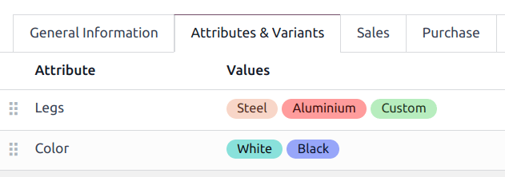
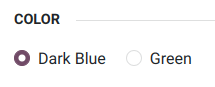
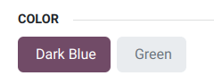
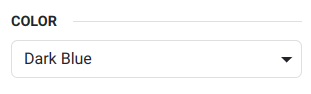
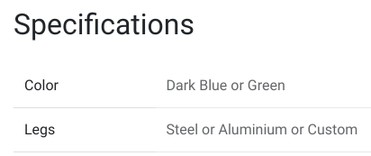

:show-content:

========
Products
========

**Odoo eCommerce** allows you to :ref:`create <products/create-products>`,
:ref:`import <products/import-products>`, and manage your :ref:`product pages
<products/product-pages>` directly within the Website app. You can also add
:ref:`product variants <products/product-variants>` and
:ref:`digital files <products/digital-files>`, :ref:`translate <products/translation>`
your product page content, :ref:`manage your stock <products/stock-management>`, and enable
:ref:`product comparisons <products/product-comparison>`.

Add products
============

.. _products/create-products:

Create products
---------------

From anywhere on your website, click :guilabel:`+ New`, then :guilabel:`Product`. Enter the
:guilabel:`Product Name`, :guilabel:`Sales Price`, the default :guilabel:`Customer Taxes` for
local transactions, and :guilabel:`Save`. You can then update the product details, add an image,
and :ref:`customize <products/customization>` the product page. When you :guilabel:`Save`, the
product page is automatically published.

.. tip::
   - You can also create a product from the backend by going to :menuselection:`Website -->
     eCommerce --> Products` and clicking :guilabel:`New`.
   - Products created from the frontend are automatically **published**, while products created from
     the backend are not. To publish a product created backend, go to your main shop page, select
     the product, and toggle the switch from :guilabel:`Unpublished` to :guilabel:`Published`.

.. _products/import-products:

Import products
---------------

You can :ref:`import products data <import-data>` using XLSX or CSV files. To do so, go to
:menuselection:`Website --> eCommerce --> Products`, click on the :icon:`fa-cog` (:guilabel:`cog`)
icon and :ref:`Import records <import-data>`.

.. _products/product-pages:

Product page
============

Once a product is created, you can access its page by going to your :guilabel:`Shop` and clicking on
it. Click :guilabel:`Edit` to :ref:`customize <products/customization>` the page or edit its
:ref:`layout <products/layout>` or content.

.. _products/product-form:

To access the backend **product form**, click the :icon:`fa-cog` :guilabel:`Product` smart button in
the top right corner of the product page. Alternatively, navigate to :menuselection:`Website -->
eCommerce --> Products` and select your product. From the form, you can customize your product page
by adding :ref:`variants <products/product-variants>`, :ref:`digital documents
<products/digital-files>`, or :ref:`translating <products/translation>` content.

.. _products/customization:

Customization
-------------

To customize a product page, click :guilabel:`Edit`. Go to the :guilabel:`Blocks` tab to add
:doc:`building blocks <../../websites/website/web_design/building_blocks>` or to the
:guilabel:`Customize` tab to modify the page :ref:`layout <products/layout>` or add features:

:guilabel:`Terms and Conditions`: toggle the switch to apply them to your product page.

:guilabel:`Customers`:

   - :guilabel:`Rating`: allows customers to submit product reviews. Only logged-in portal users can
     leave ratings. You can restrict the review to internal employees only by toggling the
     :guilabel:`Public` switch next to a review comment.
   - :guilabel:`Share`: adds social media and email icon buttons allowing users to share the product
     through those channels.

:guilabel:`Select Quantity`: toggle the switch to allow users to select the exact quantity they want
for your product.

:guilabel:`Tax indication`: toggle the switch to indicate if the price is VAT included or excluded.

:guilabel:`Variants`: show all possible :ref:`variants <products/product-variants>` of the product
as :guilabel:`Products List` or as selectable :guilabel:`Options` to compose the variant yourself.

:guilabel:`Product Tags`: toggle the switch to display the :guilabel:`Product Template Tags` on your
eCommerce, enabling product filtering by tags from the backend.

:guilabel:`Cart`:

- :guilabel:`Buy Now`: adds a :icon:`fa-bolt` :guilabel:`Buy Now` button taking the customer
  directly to the checkout page.
- :guilabel:`Wishlist`: adds a :icon:`fa-heart-o` :guilabel:`Add to wishlist` option allowing
  signed-in users to save products in a wishlist.
- :guilabel:`Compare`: adds a :icon:`fa-exchange` :guilabel:`Compare` option allowing users to
  :ref:`compare products <products/product-comparison>` based on their attributes.

:guilabel:`Specification`: select :guilabel:`Bottom of Page` to display the specification list of
the product's variants, attributes and values at the bottom of your product’s page. This option only
works for products with :ref:`variants <products/product-variants>`.

.. note::
   - To allow the :guilabel:`Variants`, :icon:`fa-heart-o` :guilabel:`Wishlist`, and
     :icon:`fa-exchange` :guilabel:`Compare` options, the features must be enabled in
     :menuselection:`Website --> Configuration --> Settings --> Shop - Products`.
   - Enabled functions apply to all product pages.

.. _products/layout:

Layout
------

The layout configuration can be changed according to your needs from the :guilabel:`Customize` tab:

- :guilabel:`Images Width`: changes the width of the product images displayed on the page.
- :guilabel:`Layout`: the :guilabel:`Carousel` layout displays a large, main image with smaller ones
  underneath; whereas the :guilabel:`Grid` displays four images in a square layout.
- :guilabel:`Image Zoom`: choose which image zooms are available, either :guilabel:`Magnifier on hover`
  :guilabel:`Pop-up on Click`, on :guilabel:`Both`, or :guilabel:`None`.
- :guilabel:`Thumbnails`: decide how the thumbnails should be aligned, either
  :icon:`fa-long-arrow-left` (:guilabel:`Left`) or :icon:`fa-long-arrow-down` (:guilabel:`Bottom`).
- :guilabel:`Main Image`: click :guilabel:`Replace` to change the product's main image.
- :guilabel:`Extra Images`: you can :guilabel:`Add` extra images or :guilabel:`Remove all` product
  images. You can also add images and videos via **URL** when clicking :guilabel:`Add`.

.. note::
   Images must be in PNG or JPG format and must be bigger than 1024x1024 to trigger the zoom.

.. tip::
   When dragging and dropping a building block on your product page, placing it above or below the
   top or bottom blue lines makes it visible on all product pages.

.. _products/product-variants:

Product variants
================

Product variants are different versions of the same product, such as various colors or materials,
with potential differences in price and availability.

Go to :menuselection:`Website --> Configuration --> Settings --> Shop - Products` to enable
:guilabel:`Product Variants`. Then, go to the :guilabel:`Attributes & Variants` tab available in the
:ref:`product forms <products/product-form>`. From there, you can add attributes and values allowing
customers to configure and select product variants on the product page. For multiple attributes, you
can combine them to create specific variants.

Combination restrictions
------------------------

Certain value combinations can be restricted, preventing customers from selecting them. To do so,
go to the :ref:`product form <products/product-form>` and to the :guilabel:`Attributes & Variants`
tab. Go to the attribute's line and click the :guilabel:`Configure` button. Click a value, and in
the :guilabel:`Exclude for` section, add a :guilabel:`Product Template` and the attribute value(s)
to exclude.

Display type
------------

You can choose how an attribute is displayed in the product configurator on your product page. To do
this, click :guilabel:`Edit` to open the website editor, select the attribute, and go to the
:guilabel:`Block` section to choose your preferred :guilabel:`Display Type`:

- :guilabel:`Radio`

- :guilabel:`Pills`

- :guilabel:`Select`

- :guilabel:`Color`

.. image:: products/color.png
   :alt: pills display type.

.. note::
   Alternatively, the :guilabel:`Display Type` can be edited through :menuselection:`Website -->
   eCommerce --> Attributes`, selecting an attribute, and then choosing a :guilabel:`Display Type`;
   or through the :ref:`product form <products/product-form>`, by going to the
   :guilabel:`Attributes & Variants` tab, clicking twice on a :guilabel:`Attribute` and going to
   :guilabel:`Display Type`.

Product specifications
----------------------

You can display your product's attributes at the bottom of the product page by going to the website
editor, :guilabel:`Customize` tab and to :guilabel:`Specification`, and selecting
:guilabel:`Bottom of Page`.

.. tip::
   Products with single values for their attributes do not generate variants but are still displayed
   in the :guilabel:`Product Specifications`.

Filter catalog
--------------

Customers can filter the catalog based on product attributes and values.

To enable attribute filtering, go to your main shop page and click :guilabel:`Edit`. Click on one of
the categories in the left column and in the :guilabel:`Customize` tab, go to :guilabel:`Categories`.
Here, enable either :guilabel:`Left or :guilabel:`Top`, in the :guilabel:`Attributes` field.

.. _products/digital-files:

Digital files
=============

You can add digital files like certificates, eBooks, or manual users to your product page. These
documents are available :ref:`before payment <products/before-payment>` on the product page or in
the customer portal :ref:`after checkout <products/after-payment>`.

To add a digital file to your product page, go to the :ref:`product form <products/product-form>`.
Then,

Click the :guilabel:`Documents` smart button, :guilabel:`NEW`, and :guilabel:`Upload your file`, or
click :guilabel:`Upload` to directly upload your file.

The :guilabel:`Name` field automatically fills in with the uploaded file's name. You can then edit
it.

.. tip::

   To edit an existing file, go to the :ref:`product form <products/product-form>`, click the
   :guilabel:`Documents` smart button, then the vertical ellipsis on the product card, and
   :guilabel:`edit`.

.. _products/before-payment:

Digital files available before payment
--------------------------------------

Let the :guilabel:`Visibility` field blank and toggle the :guilabel:`Show on product page` option to
make the file available on your product page before payment.

.. image:: products/digital-files.png
   :alt: digital file available before payment on the  product page

.. _products/after-payment:

Digital files available after payment
-------------------------------------

To make your file available after payment, choose :guilabel:`Confirmed order` in the
:guilabel:`Visibility` field and unselect the :guilabel:`Show on product page` option. The
file becomes available in the :guilabel:`Sales Orders` section on the customer's portal after
checkout.

.. _products/translation:

Translation
===========

If multiple languages are available on your website and you want to translate a product's
information, go to the :ref:`product form <products/product-form>` to enter the translated
information in the related fields. Fields that support multiple languages are identifiable by their abbreviation language (e.g., EN)
next to their field.

.. image:: products/products-field-translation.png
   :align: center
   :alt: Field translation

The eCommerce-related fields to translate are:

#. :guilabel:`Product name`;
#. :guilabel:`Out-of-Stock Message` (under the :guilabel:`Sales` tab);
#. :guilabel:`Sales Description` (under the :guilabel:`Sales` tab).

.. note::
   - Having untranslated content on a web page may be detrimental to the user experience and
     :doc:`SEO <../../websites/website/pages/seo>`.
   - To check the language(s) of your website, go to :menuselection:`Website --> Configuration -->
     Settings --> Website Info section`.

Website availability
--------------------

A product can be available on either *one* website or *all* websites. It is not possible to select
*some* websites and not others.

To set availability, open the :ref:`product form <products/product-form>`, go to the
:guilabel:`Sales` tab, and in the :guilabel:`eCommerce shop` section, and select the
:guilabel:`Website` you wish the product to be available on. Leave the field blank to make the
product available on *all* websites.

.. _products/stock-management:

Stock management
================

Go to :menuselection:`Website --> Configuration --> Settings --> Shop - Products`, to enable and
configure inventory management options.

.. important::
   - The **Inventory** app must be installed to see the inventory management options.
   - To display the stock level on your product page, the :guilabel:`Product Type` must be set to
     :guilabel:`Storable` in the :ref:`product form <products/product-form>`.

Inventory
---------

In the :guilabel:`Inventory Defaults` sub-section, select your eCommerce selling strategy:

- :guilabel:`Out-of-Stock`: enable :guilabel:`Continue Selling` to allow customers to continue
  placing orders even when the product is **out-of-stock**. Leave the box unchecked to
  **prevent orders**;
- :guilabel:`Show Available Qty`: displays the available quantity left under a specified threshold
  on the product page. The available quantity is calculated based on the 'On hand' quantity minus
  the quantity already reserved for outgoing transfers.

.. _products/product-comparison:

Product comparison
==================

Your visitors can compare products based on their attributes when the :guilabel:`Product Comparison
Tool` is enabled. You can activate it by going to :menuselection:`Website --> Configuration -->
Settings --> Shop - Products` section.

.. note::
   The :guilabel:`Product Comparison Tool` can only be used if :doc:`attributes <products/variants>`
   are set on the :ref:`product form <products/product-form>`.

On your main shop page, click the :icon:`fa-exchange` (:guilabel:`Compare`) option on the products
you want to compare. Then, click :icon:`fa-exchange` :guilabel:`Compare` in the pop-up window at the
bottom of the page to reach the comparison summary.

.. image:: products/products-compare.png
   :align: center
   :alt: Product comparison window

.. toctree::
   :titlesonly:

   products/catalog
   products/variants
   products/price_management
   products/cross_upselling
